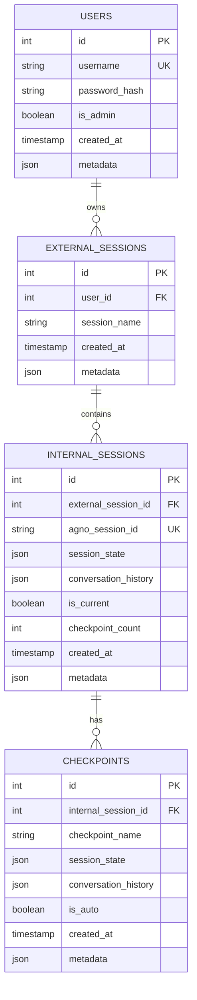

# Database Schema

## Overview

The Rollback Agent System uses SQLite as its primary database, with a flexible JSON storage approach for complex data structures.

## Database Files

```
data/
├── rollback.db         # Main application database
└── agno_sessions.db    # Agno framework session storage
```

## Schema Design

### Users Table

Stores user authentication and profile information.

```sql
CREATE TABLE users (
    id INTEGER PRIMARY KEY AUTOINCREMENT,
    username TEXT UNIQUE NOT NULL,
    password_hash TEXT NOT NULL,
    is_admin BOOLEAN DEFAULT FALSE,
    created_at TIMESTAMP DEFAULT CURRENT_TIMESTAMP,
    metadata JSON DEFAULT '{}'
);

CREATE INDEX idx_users_username ON users(username);
```

**Fields:**
- `id`: Unique user identifier
- `username`: Unique username for authentication
- `password_hash`: Bcrypt hashed password
- `is_admin`: Admin privileges flag
- `created_at`: Account creation timestamp
- `metadata`: Additional user data (JSON)

**Example Metadata:**
```json
{
    "email": "user@example.com",
    "preferences": {
        "theme": "dark",
        "auto_checkpoint": true
    },
    "last_login": "2024-01-15T10:30:00Z"
}
```

### External Sessions Table

Represents user projects or conversation containers.

```sql
CREATE TABLE external_sessions (
    id INTEGER PRIMARY KEY AUTOINCREMENT,
    user_id INTEGER NOT NULL,
    session_name TEXT,
    created_at TIMESTAMP DEFAULT CURRENT_TIMESTAMP,
    metadata JSON DEFAULT '{}',
    FOREIGN KEY (user_id) REFERENCES users(id) ON DELETE CASCADE
);

CREATE INDEX idx_external_sessions_user_id ON external_sessions(user_id);
CREATE INDEX idx_external_sessions_created_at ON external_sessions(created_at);
```

**Fields:**
- `id`: Unique session identifier
- `user_id`: Owner of the session
- `session_name`: Human-readable session name
- `created_at`: Session creation timestamp
- `metadata`: Additional session data

**Example Metadata:**
```json
{
    "description": "Learning Python basics",
    "tags": ["education", "python"],
    "settings": {
        "model": "gpt-4o-mini",
        "temperature": 0.7
    }
}
```

### Internal Sessions Table

Individual conversation branches within an external session.

```sql
CREATE TABLE internal_sessions (
    id INTEGER PRIMARY KEY AUTOINCREMENT,
    external_session_id INTEGER NOT NULL,
    agno_session_id TEXT UNIQUE NOT NULL,
    session_state JSON DEFAULT '{}',
    conversation_history JSON DEFAULT '[]',
    is_current BOOLEAN DEFAULT FALSE,
    checkpoint_count INTEGER DEFAULT 0,
    created_at TIMESTAMP DEFAULT CURRENT_TIMESTAMP,
    metadata JSON DEFAULT '{}',
    FOREIGN KEY (external_session_id) REFERENCES external_sessions(id) ON DELETE CASCADE
);

CREATE INDEX idx_internal_sessions_external_id ON internal_sessions(external_session_id);
CREATE INDEX idx_internal_sessions_agno_id ON internal_sessions(agno_session_id);
CREATE INDEX idx_internal_sessions_current ON internal_sessions(is_current);
```

**Fields:**
- `id`: Unique internal session identifier
- `external_session_id`: Parent external session
- `agno_session_id`: Link to Agno framework storage
- `session_state`: Current state dictionary (JSON)
- `conversation_history`: Message history array (JSON)
- `is_current`: Flag for active session
- `checkpoint_count`: Number of checkpoints created
- `created_at`: Creation timestamp
- `metadata`: Additional data

**Session State Example:**
```json
{
    "context": "learning_python",
    "level": "beginner",
    "topics_covered": ["variables", "functions"],
    "rollback_requested": false
}
```

**Conversation History Example:**
```json
[
    {
        "role": "user",
        "content": "Hello, teach me Python",
        "timestamp": "2024-01-15T10:00:00Z"
    },
    {
        "role": "assistant",
        "content": "I'll help you learn Python! Let's start with basics...",
        "timestamp": "2024-01-15T10:00:05Z"
    }
]
```

### Checkpoints Table

Snapshots of conversation state at specific points.

```sql
CREATE TABLE checkpoints (
    id INTEGER PRIMARY KEY AUTOINCREMENT,
    internal_session_id INTEGER NOT NULL,
    checkpoint_name TEXT,
    session_state JSON DEFAULT '{}',
    conversation_history JSON DEFAULT '[]',
    is_auto BOOLEAN DEFAULT FALSE,
    created_at TIMESTAMP DEFAULT CURRENT_TIMESTAMP,
    metadata JSON DEFAULT '{}',
    FOREIGN KEY (internal_session_id) REFERENCES internal_sessions(id) ON DELETE CASCADE
);

CREATE INDEX idx_checkpoints_internal_session ON checkpoints(internal_session_id);
CREATE INDEX idx_checkpoints_created_at ON checkpoints(created_at);
CREATE INDEX idx_checkpoints_is_auto ON checkpoints(is_auto);
```

**Fields:**
- `id`: Unique checkpoint identifier
- `internal_session_id`: Parent internal session
- `checkpoint_name`: User-friendly checkpoint name
- `session_state`: State at checkpoint time (JSON)
- `conversation_history`: Messages up to checkpoint (JSON)
- `is_auto`: Automatic vs manual checkpoint
- `created_at`: Checkpoint creation time
- `metadata`: Additional checkpoint data

**Metadata Example:**
```json
{
    "trigger": "tool_call",
    "tool_name": "calculate_tool",
    "message_count": 15,
    "importance": "high"
}
```

## Relationships



## JSON Schema Definitions

### Session State Schema

```json
{
    "$schema": "http://json-schema.org/draft-07/schema#",
    "type": "object",
    "properties": {
        "context": {"type": "string"},
        "rollback_requested": {"type": "boolean"},
        "rollback_checkpoint_id": {"type": "integer"},
        "custom_data": {"type": "object"}
    }
}
```

### Conversation Message Schema

```json
{
    "$schema": "http://json-schema.org/draft-07/schema#",
    "type": "object",
    "required": ["role", "content"],
    "properties": {
        "role": {
            "type": "string",
            "enum": ["user", "assistant", "system"]
        },
        "content": {"type": "string"},
        "timestamp": {
            "type": "string",
            "format": "date-time"
        },
        "metadata": {"type": "object"}
    }
}
```

## Query Examples

### Get User's Active Sessions

```sql
SELECT 
    es.id as external_id,
    es.session_name,
    is.id as internal_id,
    is.checkpoint_count,
    is.created_at
FROM external_sessions es
JOIN internal_sessions is ON es.id = is.external_session_id
WHERE es.user_id = ? AND is.is_current = TRUE
ORDER BY is.created_at DESC;
```

### Find Checkpoints for Rollback

```sql
SELECT 
    id,
    checkpoint_name,
    created_at,
    is_auto,
    json_extract(metadata, '$.message_count') as message_count
FROM checkpoints
WHERE internal_session_id = ?
ORDER BY created_at DESC
LIMIT 10;
```

### Session Statistics

```sql
SELECT 
    u.username,
    COUNT(DISTINCT es.id) as session_count,
    COUNT(DISTINCT is.id) as branch_count,
    COUNT(DISTINCT c.id) as checkpoint_count
FROM users u
LEFT JOIN external_sessions es ON u.id = es.user_id
LEFT JOIN internal_sessions is ON es.id = is.external_session_id
LEFT JOIN checkpoints c ON is.id = c.internal_session_id
GROUP BY u.id;
```

## Migration Strategy

### Version Control

```sql
CREATE TABLE schema_version (
    version INTEGER PRIMARY KEY,
    applied_at TIMESTAMP DEFAULT CURRENT_TIMESTAMP
);
```

### Migration Example

```python
def migrate_v1_to_v2(connection):
    """Add metadata field to checkpoints table."""
    cursor = connection.cursor()
    cursor.execute("""
        ALTER TABLE checkpoints 
        ADD COLUMN metadata JSON DEFAULT '{}'
    """)
    cursor.execute("""
        UPDATE schema_version SET version = 2
    """)
    connection.commit()
```

## Performance Optimization

### Indexes

Critical indexes for performance:

1. **User lookups**: `idx_users_username`
2. **Session queries**: `idx_external_sessions_user_id`
3. **Internal session access**: `idx_internal_sessions_external_id`
4. **Checkpoint retrieval**: `idx_checkpoints_internal_session`
5. **Time-based queries**: `*_created_at` indexes

### JSON Indexing

For frequently queried JSON fields:

```sql
CREATE INDEX idx_checkpoints_auto_tool 
ON checkpoints(is_auto, json_extract(metadata, '$.tool_name'));
```

## Backup and Recovery

### Backup Strategy

```bash
# Daily backup
sqlite3 data/rollback.db ".backup data/backups/rollback_$(date +%Y%m%d).db"

# Export to SQL
sqlite3 data/rollback.db .dump > data/backups/rollback_$(date +%Y%m%d).sql
```

### Recovery

```bash
# Restore from backup
cp data/backups/rollback_20240115.db data/rollback.db

# Restore from SQL dump
sqlite3 data/rollback.db < data/backups/rollback_20240115.sql
```

## Data Retention

### Cleanup Policies

```python
# Delete old automatic checkpoints
DELETE FROM checkpoints 
WHERE is_auto = TRUE 
AND created_at < datetime('now', '-7 days');

# Archive old sessions
INSERT INTO archived_sessions 
SELECT * FROM internal_sessions 
WHERE created_at < datetime('now', '-30 days');
```

## Security Considerations

1. **SQL Injection Prevention**
   - Use parameterized queries
   - Validate all inputs

2. **Sensitive Data**
   - Encrypt password_hash field
   - Sanitize conversation history

3. **Access Control**
   - Row-level security via user_id
   - Admin-only operations flagged

## Next Steps

- [API Reference](../api/index.md) - Database access APIs
- [Repository Pattern](../api/database/repositories.md) - Data access layer
- [Development Guide](../development/contributing.md) - Database migrations