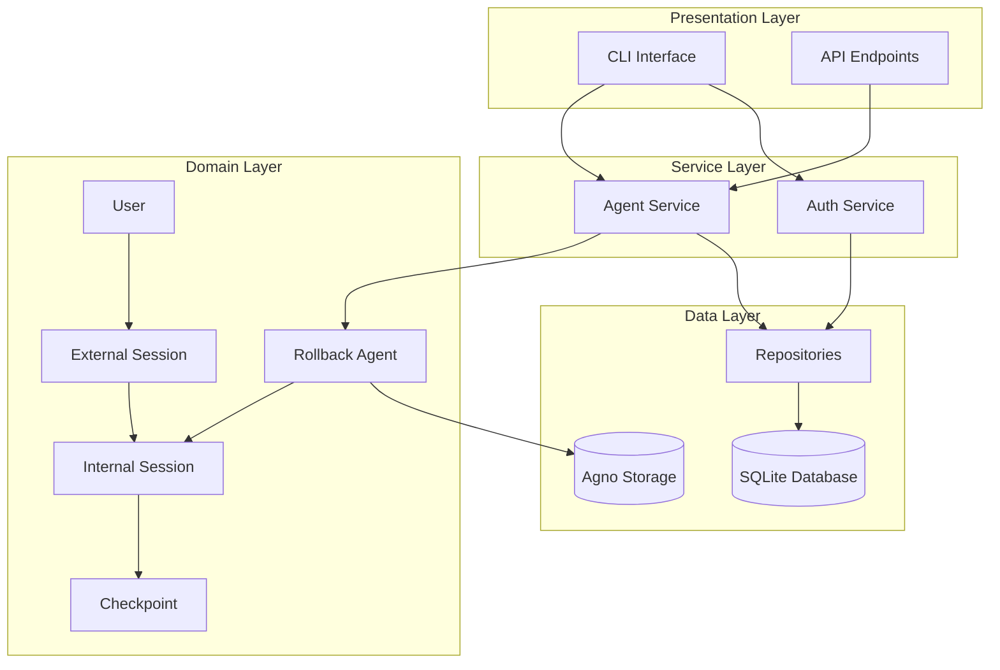
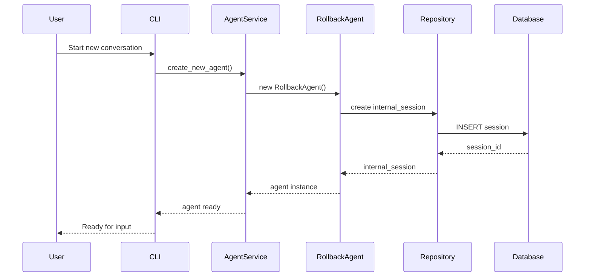
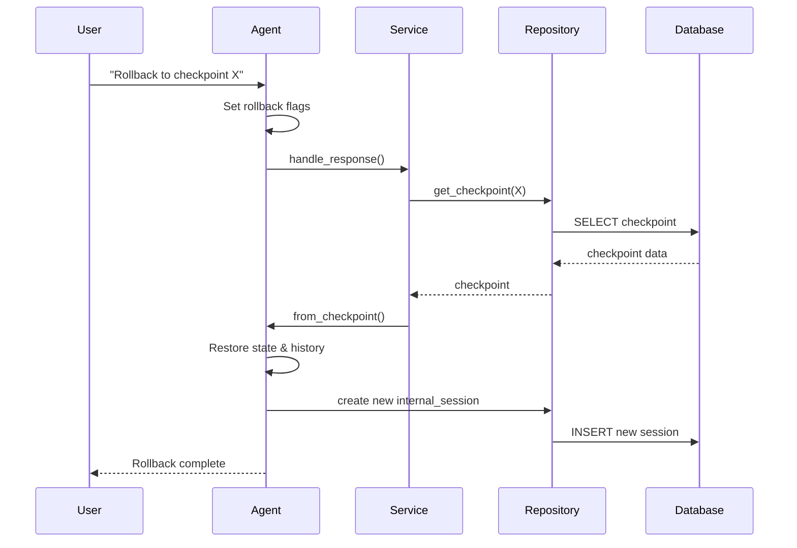

# Architecture Overview

## System Design

The Rollback Agent System is built on a layered architecture that separates concerns and provides flexibility for extensions.



## Core Components

### 1. RollbackAgent

The heart of the system, extending Agno's base Agent class.

**Key Responsibilities:**
- Manage conversation state
- Create automatic checkpoints
- Handle rollback requests
- Integrate custom tools
- Preserve conversation history

**Key Features:**
```python
class RollbackAgent(Agent):
    def __init__(self, external_session_id, model, auto_checkpoint=True)
    def run(self, message: str) -> Response
    def create_checkpoint(self, name: str) -> Checkpoint
    def from_checkpoint(cls, checkpoint_id: int) -> RollbackAgent
```

### 2. Session Management

#### External Sessions
- Represent user projects or conversation topics
- Contains multiple internal sessions
- Persistent across application restarts

#### Internal Sessions  
- Individual conversation branches
- Contains conversation history and state
- Created on new conversations or rollbacks
- Linked to Agno session storage

```python
External Session (User's "Python Learning" project)
    ├── Internal Session 1 (Initial conversation)
    ├── Internal Session 2 (After rollback to checkpoint A)
    └── Internal Session 3 (After rollback to checkpoint B)
```

### 3. Checkpoint System

Checkpoints capture complete conversation state at a point in time.

**Checkpoint Data:**
- Conversation history
- Session state
- Metadata (timestamp, name, type)
- Tool call information

**Types:**
- **Manual**: User-triggered via command
- **Automatic**: Created after tool usage

### 4. Repository Pattern

Clean separation between business logic and data access.

```python
# Repository Interface
class Repository(ABC):
    def create(self, entity) -> Entity
    def get_by_id(self, id) -> Entity
    def update(self, entity) -> bool
    def delete(self, id) -> bool
```

**Repositories:**
- `UserRepository` - User management
- `ExternalSessionRepository` - External sessions
- `InternalSessionRepository` - Internal sessions
- `CheckpointRepository` - Checkpoints

### 5. Authentication System

Simple but extensible authentication system.

**Features:**
- Password hashing (bcrypt)
- User roles (admin/regular)
- Session-based access control

## Data Flow

### Creating a New Conversation



### Rollback Process



## Database Schema

### Core Tables

```sql
-- Users table
CREATE TABLE users (
    id INTEGER PRIMARY KEY,
    username TEXT UNIQUE NOT NULL,
    password_hash TEXT NOT NULL,
    is_admin BOOLEAN DEFAULT FALSE,
    created_at TIMESTAMP,
    metadata JSON
);

-- External sessions
CREATE TABLE external_sessions (
    id INTEGER PRIMARY KEY,
    user_id INTEGER REFERENCES users(id),
    session_name TEXT,
    created_at TIMESTAMP,
    metadata JSON
);

-- Internal sessions  
CREATE TABLE internal_sessions (
    id INTEGER PRIMARY KEY,
    external_session_id INTEGER REFERENCES external_sessions(id),
    agno_session_id TEXT UNIQUE,
    session_state JSON,
    conversation_history JSON,
    is_current BOOLEAN DEFAULT FALSE,
    checkpoint_count INTEGER DEFAULT 0,
    created_at TIMESTAMP,
    metadata JSON
);

-- Checkpoints
CREATE TABLE checkpoints (
    id INTEGER PRIMARY KEY,
    internal_session_id INTEGER REFERENCES internal_sessions(id),
    checkpoint_name TEXT,
    session_state JSON,
    conversation_history JSON,
    is_auto BOOLEAN DEFAULT FALSE,
    created_at TIMESTAMP,
    metadata JSON
);
```

## Storage Strategy

### Dual Storage System

1. **SQLite (Rollback System)**
   - User management
   - Session hierarchy
   - Checkpoints
   - Metadata

2. **Agno Storage**
   - Conversation messages
   - Tool call history
   - Model-specific data

### Why Dual Storage?

- **Separation of Concerns**: Agno handles AI-specific data
- **Flexibility**: Can swap Agno storage backends
- **Performance**: Optimized queries for each data type
- **Compatibility**: Works with Agno ecosystem

## Extension Points

### Adding Custom Tools

```python
def my_custom_tool(param: str) -> str:
    """Tool description for the model."""
    return f"Processed: {param}"

agent = RollbackAgent(
    external_session_id=1,
    model=model,
    tools=[my_custom_tool]
)
```

### Custom Repositories

```python
class MongoCheckpointRepository(CheckpointRepository):
    def __init__(self, connection_string):
        self.db = MongoClient(connection_string)
    
    def create(self, checkpoint):
        # MongoDB implementation
        pass
```

### Authentication Providers

```python
class OAuthProvider(AuthProvider):
    def authenticate(self, token):
        # OAuth implementation
        pass
```

## Performance Considerations

### Optimization Strategies

1. **Lazy Loading**
   - Load conversation history on demand
   - Stream large checkpoints

2. **Indexing**
   - Index on foreign keys
   - Index on timestamp for queries

3. **Caching**
   - Cache current session in memory
   - LRU cache for recent checkpoints

4. **Cleanup**
   - Auto-cleanup old checkpoints
   - Archive old sessions

### Scalability

- **Horizontal**: Multiple agent instances
- **Vertical**: Increase resources per instance
- **Distributed**: Redis for session state
- **Cloud**: S3 for checkpoint storage

## Security Considerations

1. **Authentication**
   - Bcrypt password hashing
   - Session tokens
   - Role-based access

2. **Data Protection**
   - SQL injection prevention
   - Input validation
   - Encrypted storage (optional)

3. **API Security**
   - Rate limiting
   - API key management
   - HTTPS enforcement

## Next Steps

- [Database Schema](database.md) - Detailed database design
- [API Reference](../api/index.md) - Component APIs
- [Development Guide](../development/contributing.md) - Extend the system