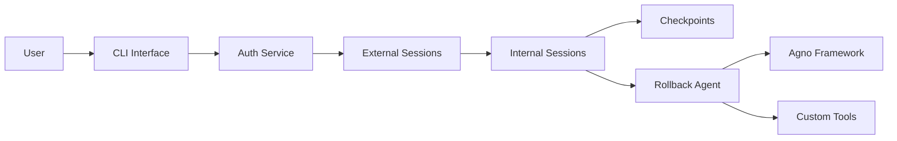

# Rollback Agent System

## AI Conversations with Time Travel ⏰

The **Rollback Agent System** is a sophisticated AI agent framework built on [Agno](https://github.com/agno-ai/agno) that provides checkpoint and rollback capabilities for conversational AI. Think of it as "version control" for AI conversations.

!!! tip "What makes it special?"
    Save conversation states at any point and roll back to previous checkpoints, enabling exploration of different conversation paths without losing context.

## 🚀 Features

### Core Capabilities

- **🔄 Full Snapshot Rollback** - Roll back to any checkpoint with complete state preservation
- **🤖 Intelligent Agents** - Built on Agno with automatic checkpointing after tool usage
- **👥 Multi-User Support** - Authentication, user management, and isolated sessions
- **📁 Hierarchical Sessions** - External sessions containing multiple internal conversation branches
- **🛠️ Custom Tools** - Extend agents with custom tools while maintaining checkpoint functionality
- **💾 Persistent Storage** - SQLite database with repository pattern for clean data access

### Advanced Features

- **Automatic Checkpointing** - Creates checkpoints after every tool call
- **Manual Checkpoints** - Save named checkpoints via natural language
- **Nested Rollbacks** - Rollback from already rolled-back states
- **Session Branching** - Explore multiple conversation paths from the same point
- **Visual CLI** - Color-coded interface with session hierarchy display

## 📊 Architecture Overview



## 🎯 Quick Start

```bash
# Install dependencies
pip install -r requirements.txt

# Set OpenAI API key
export OPENAI_API_KEY='your-key-here'

# Run the advanced CLI
python example/advanced_cli.py
```

### Simple Example

```python
from src.agents.agent_service import AgentService

# Create agent
agent_service = AgentService()
agent = agent_service.create_new_agent(session_id=1)

# Chat and create checkpoint
agent.run("Hello! Let's discuss Python.")
agent.run("Create checkpoint 'before-math'")

# Continue conversation
agent.run("Now explain calculus.")

# Rollback to checkpoint
agent.run("Rollback to before-math")
# Conversation restored to Python discussion!
```

## 📚 Documentation

| Section | Description |
|---------|-------------|
| [Getting Started](getting-started/quickstart.md) | Installation and first steps |
| [User Guide](user-guide/index.md) | Complete feature guide |
| [Architecture](architecture/overview.md) | System design details |
| [API Reference](api/index.md) | Complete API documentation |
| [Examples](examples/index.md) | Code examples and tutorials |
| [CLI Guide](cli/index.md) | Command-line interface guide |

## 🎨 Use Cases

- **Development & Testing** - Test different agent behaviors with save/restore
- **Educational Demos** - Show multiple outcomes from the same starting point
- **Conversation Exploration** - Try different approaches without losing context
- **Error Recovery** - Rollback from failed operations or unwanted directions
- **Complex Workflows** - Build branching conversation trees

## 🏗️ Project Structure

```
rollback-agent/
├── src/                    # Source code
│   ├── agents/            # Agent implementation
│   ├── auth/              # Authentication system
│   ├── checkpoints/       # Checkpoint management
│   ├── database/          # Repository pattern
│   ├── sessions/          # Session management
│   └── ui/                # CLI interface
├── example/               # Example scripts
│   ├── advanced_cli.py    # Full-featured CLI
│   └── test_*.py         # Test scripts
├── tests/                 # Unit tests
└── docs/                  # Documentation
```

## 🤝 Contributing

We welcome contributions! See our [Contributing Guide](development/contributing.md) for details.

## 📄 License

This project is licensed under the MIT License.